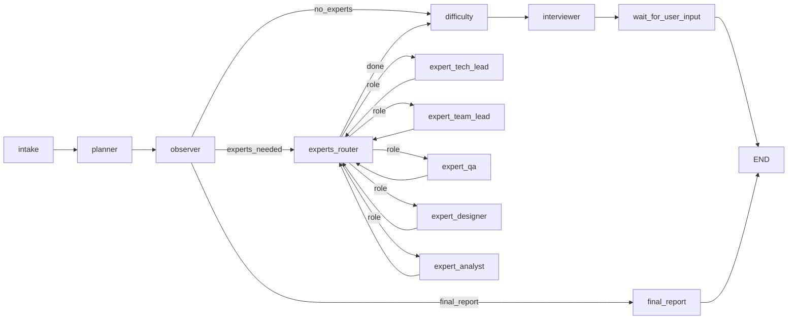
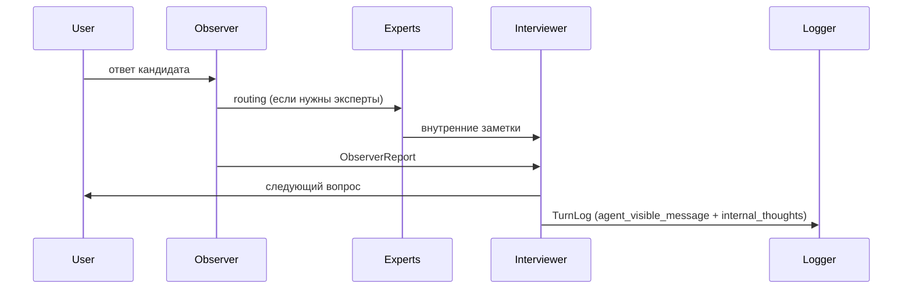

# Multi-Agent Interview Coach

Многоагентный тренер технических интервью: планирует темы, маршрутизирует по Observer, подключает экспертов и завершает интервью финальным отчётом. Архитектура построена на LangGraph StateGraph, все ключевые ответы — structured output через Pydantic v2.

## Что умеет
- **Роли/агенты**: Planner, Observer, Interviewer, Expert (5 профилей), Report writer.
- **Hidden reflection**: скрытая логика Observer/Interviewer попадает в `internal_thoughts` лога.
- **Контекстная адаптация**: маршрутизация по теме, выбор экспертов, защита от повторов вопросов.
- **Динамическая сложность**: узел `difficulty` корректирует уровень по сигналам Observer.
- **Финальный отчёт**: структурированный `FinalFeedback` + читаемое резюме.
- **CLI и сценарии**: интерактивный режим и прогон скриптовых интервью.
- **Строгие контракты**: Pydantic v2 модели для всех structured outputs.

## Схемы
### Граф диалога


### Hidden reflection и логирование


## Поток в графе
Текущий граф в `src/interview_coach/graph.py`:

- **Planner** строит план из **10 тем** (`PlannedTopics`).
- **Observer** возвращает `ObserverReport` (флаги, рекомендации, `skills_delta`) и routing для экспертов.
- **Experts** (tech lead / team lead / QA / designer / analyst) дают внутренние заметки для Interviewer.
- **Difficulty** корректирует сложность (EASY/MEDIUM/HARD) по `answer_quality`.
- **Interviewer** генерирует следующий вопрос и обновляет `internal_thoughts`.
- **Report** формирует `FinalFeedback` при остановке.

## Основные компоненты
- `src/interview_coach/graph.py` — сборка графа.
- `src/interview_coach/agents.py` — модели и агенты (create_agent + structured outputs).
- `src/interview_coach/models.py` — все Pydantic контракты.
- `src/interview_coach/nodes/` — узлы графа (planner, observer, experts, interviewer, report).
- `src/interview_coach/cli.py` — интерактивный CLI.
- `src/interview_coach/scenarios.py` — сценарные прогоны.
- `src/interview_coach/logger.py` — формат логов.
- `prompts/*.md` — отдельные системные промпты по ролям.

## Контракты данных (кратко)
- `InterviewIntake`: имя, позиция, целевой грейд, опыт.
- `PlannedTopics`: **ровно 10 тем**, порядок важен.
- `ObserverReport`: тема, `answer_quality`, `flags`, `recommended_next_action`, `skills_delta`.
- `ExpertEvaluation`: комментарий эксперта + optional уточняющий вопрос.
- `SkillMatrix`: накопление навыков (подтверждения/пробелы + evidence).
- `FinalFeedback`: итоговая оценка (decision, hard/soft skills, roadmap).
- `TurnLog`: видимый текст + `internal_thoughts` в формате `"[Observer]: ... [Interviewer]: ..."` + метаданные.

## Логи
Логи пишутся в `runs/` и имеют схему:
```
{
  "participant_name": "...",
  "turns": [
    {"turn_id": 1, "agent_visible_message": "...", "user_message": "...", "internal_thoughts": "..."}
  ],
  "final_feedback": "..."
}
```
`internal_thoughts` обязателен для каждого хода. Observer возвращает строго JSON по схеме, без текста вне структуры.

## Быстрый старт
### Установка
```bash
uv venv
source .venv/bin/activate
uv sync
```

### Переменные окружения
Поддерживаются (через `.env` или env):
```
OPENAI_API_KEY=sk-...
OPENAI_BASE_URL=https://api.your-gateway.example/v1
```
Также поддерживается алиас `OPENAI_API_BASE`.

### Запуск CLI
```bash
uv run python -m src.interview_coach.cli --max-turns 12
```
Команды остановки: `stop`, `стоп`, `стоп интервью`.

### Запуск сценария
```bash
uv run python -m src.interview_coach.scenarios --scenario examples/scenarios/sample.json
```

## Docker (быстрый запуск)
Сборка:
```bash
docker build -t interview-coach .
```

Запуск CLI:
```bash
docker run --rm -it \\
  -e OPENAI_API_KEY=sk-... \\
  -v \"$PWD/runs:/app/runs\" \\
  interview-coach --max-turns 12
```

Запуск сценария:
```bash
docker run --rm \\
  -e OPENAI_API_KEY=sk-... \\
  -v \"$PWD/runs:/app/runs\" \\
  interview-coach -m src.interview_coach.scenarios --scenario examples/scenarios/sample.json
```

## Качество и тесты
```bash
uv run ruff format
uv run ruff check
uv run pytest
```

## Примеры
- Сценарии: `examples/scenarios/`
- Логи прогонов: `runs/`
- Мини-прогоны: `docs/examples/`

## Требования
- Python `>= 3.14`
- Pydantic v2, LangChain, LangGraph (см. `pyproject.toml`)
