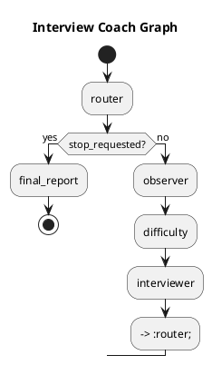
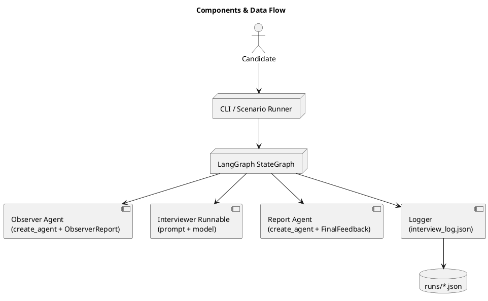
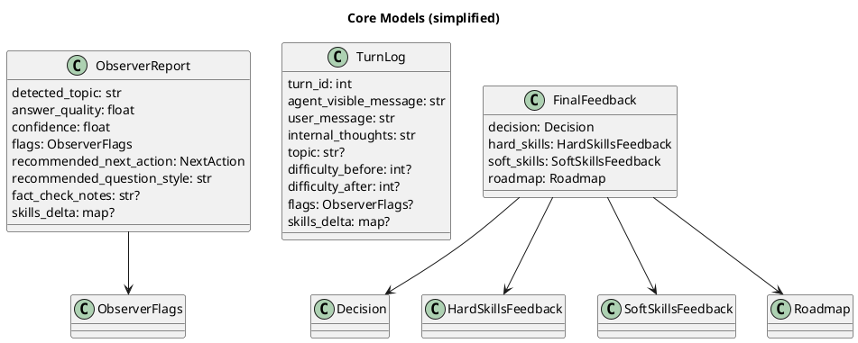

# Multi-Agent Interview Coach

Проект: **Multi-Agent Interview Coach** — многоагентный тренер интервью с двумя ролями (Interviewer + Observer), скрытой рефлексией и финальным отчётом.

## Архитектура (коротко)
- **LangGraph StateGraph** управляет диалогом и маршрутизацией узлов.
- **Interviewer** генерирует видимые вопросы/ответы и опирается на скрытый отчёт Observer.
- **Observer** возвращает строго структурированный JSON (Pydantic v2) с оценкой и флагами.
- **Difficulty node** корректирует сложность по сигналам Observer.
- **Report node** формирует финальный структурированный отчёт.
- **Logger** пишет `interview_log.json` с `internal_thoughts` по каждому ходу.

## Поток исполнения (StateGraph)


## Компоненты и ответственность


## Как агент “думает”
- **Observer** получает историю и контекст, возвращает `ObserverReport` (строго JSON).
- **Interviewer** получает контекст + `ObserverReport` и выбирает стратегию (`deepen`, `simplify`, `wrap_up` и т.д.).
- **Hidden reflection** сохраняется в `TurnLog.internal_thoughts` в формате:
  `"[Observer]: ... [Interviewer]: ..."` — это обязателен контракт логов.

## Основные файлы
- `src/interview_coach/graph.py` — сборка графа и маршрутизация.
- `src/interview_coach/nodes/observer.py` — вызов Observer + обновление skill_matrix.
- `src/interview_coach/nodes/difficulty.py` — адаптация сложности (1..5).
- `src/interview_coach/nodes/interviewer.py` — генерация ответа и запись `TurnLog`.
- `src/interview_coach/nodes/report.py` — финальный отчёт.
- `src/interview_coach/agents.py` — фабрики моделей и агентов.
- `src/interview_coach/models.py` — Pydantic v2 модели (контракты).
- `src/interview_coach/logger.py` — запись `interview_log.json`.
- `prompts/*.md` — системные промпты агентов (строго раздельные).

## Контракты данных (Pydantic v2)


## Как работает адаптация сложности
- Узел `difficulty` меняет уровень, если **answer_quality >= 4** (повышение) или **<= 2** (понижение).
- Если флаги `off_topic`, `hallucination`, `role_reversal` активны — сложность **не меняется**.

## Логи и формат
- Лог хранится в `runs/interview_log_*.json`.
- Каждый `turn` содержит `turn_id`, `agent_visible_message`, `user_message`, `internal_thoughts`.
- В `internal_thoughts` обязательно присутствуют данные Observer и выбранная стратегия Interviewer.

## Setup
```bash
uv venv
source .venv/bin/activate
uv sync
```

## Environment
Настройки читаются через `pydantic-settings` из переменных окружения и файла `.env` в корне проекта.

Поддерживаемые параметры:
```
OPENAI_API_KEY=sk-...
OPENAI_BASE_URL=https://api.your-gateway.example/v1
```
Также поддерживается алиас `OPENAI_API_BASE` для base URL.

## Run CLI
```bash
uv run python -m interview_coach.cli
```

## Run Scenario
```bash
uv run python -m interview_coach.scenarios --scenario examples/scenarios/sample.json
```

## Run Tests
```bash
uv run pytest
```

## Output logs
```bash
ls runs/
```
